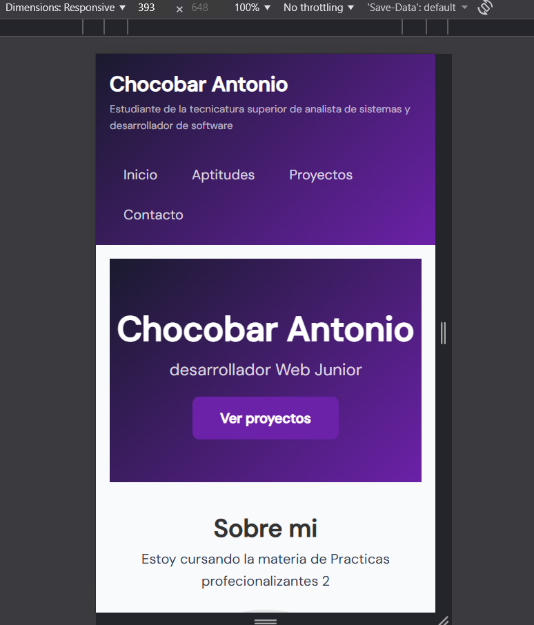
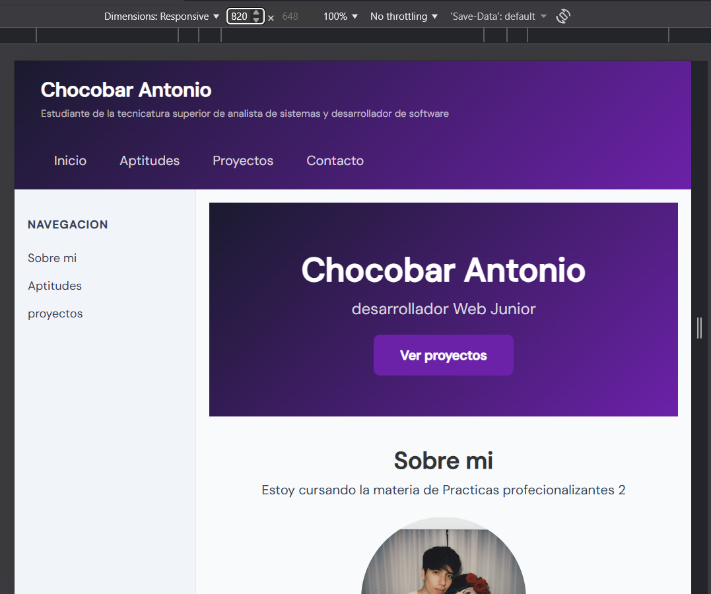
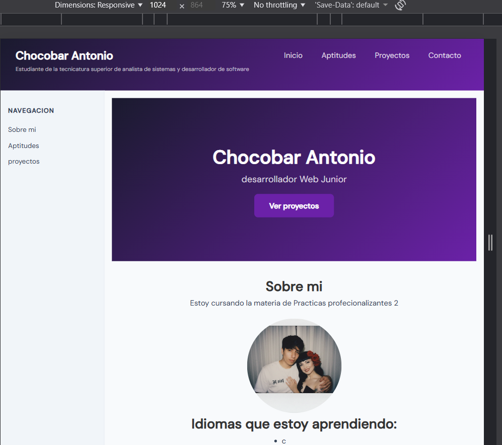

# Trabajo Practico 1

**Nombre Complreto** Antonio Chocobar
**Numero de tp:** 1
**Fecha:** 16/03/2026

## Description del sitio web
Es un sitio web personal creado porque estabamos armando nuestro portafolio. Incluye informacion sobre mi, aptitudes y mis proyectos.

## Tecnologias Usadas
- HTML5
- CSS
- Flexbox
- CSS Grid
- Responsive Design

##  Link del sitio
[Ver sitio en vivo](https://antony27c.github.io/Portafolio/)

## Capturas de pantallas 
### Mobile (393px)

### Tablet (820px)

### Computadora (1024px)

## Ruta de instalacion de Git
c:\Program files\git\cmd\git.exe

# Reflexion 
Durante la creacion de mi sitio we aprendi que la terminal llega a ser mas eficiente. Al principio me  parecia complicado y no entendia para que servia si podira crear carpeta y archivos con el mouse. Mientra fui creando mi sitio web me di cuenta que con unos pocos comandos podia hacer lo mismo pero mucho mas rapido.Creo que aunque la interfaz grafica es mas intuitiva, la terminal te da mas control y precision sobre lo que haces. 